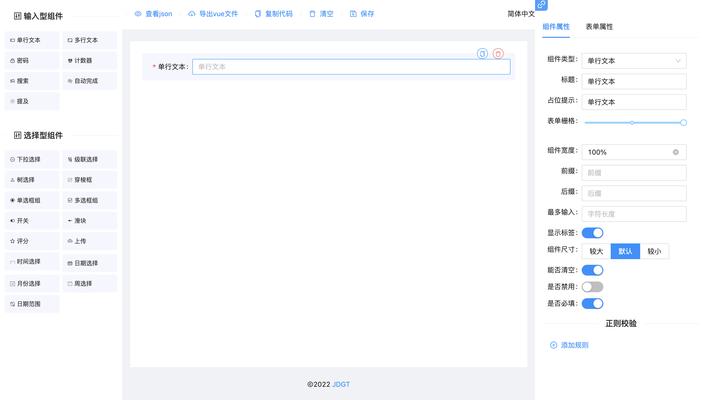

## cfl-from-design

[](https://github.com/chaifuling/cfl-from-design) [](https://github.com/chaifuling)

### cfl-from-design 是基于 [****ant-design-vue****](**https://github.com/chaifuling/cfl-from-design**) vue3版本实现的表单设计器组件。可以通过拖拽的方式快速创建表单，提高开发者对表单的开发效率，节省开发者的时间。

***\*[****文档****](**开发中**) | [****在线演示****](**暂无**)\****

## 引入

**NodeJs:**

```
npm install cfl-from-design@next
```

请自行导入cfl-from-design并挂载

```
import FromDesign from 'cfl-from-design'
import 'cfl-from-design/lib/from-design.css'

  // 嵌入表单
  app.use(FromDesign)
```

## 使用

```
<template>
    <!-- 表单设计器 -->
   <form-design :formConfig="form" @save="hanleSave"></form-design> 
     <!-- 表单预览器 -->
    <form-view-page :formConfig="formConfig"></form-view-page>
</template>

<script scope>
import 'cfl-from-design/lib/from-design.css'
</script>

```


## 设置多语言

通过 locale 配置项设置语言, 内部自带支持多语言

```
<template>
  <form-design :locale="locale"></form-design>
</template>

<script>
export default {
  data(){
    return {
        locale: En,
    }
  }
}
</script>
```


## 组件`props`

- **formConfig**`formConfig` 表单的配置文件
- **save**`function` 组件保存后回调的配置
- **locale**`object` 设置多语言

## 


## License

[MIT](http://opensource.org/licenses/MIT)

Copyright (c) 2023-caifuling